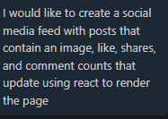

What did you ask Copilot to help you build? How did you break down the problem?
    Copilot helped me build most of it honestly, I wasnt doing 
    anything super complex so it was able to do basic formatting
    and features which it was able to help it well, its all
    only react rendered though with no backend so its just fancy
    screens with little interactivity
How did your approach to asking questions change as you worked?
    They got more specific as time went on, I started with the most general form of what I wanted and went on to specific
    features and such.
    Here's the first, most general message sent: 
What parts of the development process with GitHub Copilot surprised you?
    How similar the devliered product was to current apps with a 
    similar end goal which makes sense when you think about it I mean AI just basically mashes up and reproduces existing ideas or products so it makes sense that without meticulous levels of specificity it would resemble other products.
What did you learn about the technology you used that you didn't know before?
    How much liberty it's willing to take if you dont give it exact parts to change, I asked for a general website using react and it did basically all the work of a very basic layout and structure for the prompt where it took multiple minutes after my first prompt.
What would you do differently if you had to build this again?
    I would be more active in the creation of the code, I basically took a backseat in the design process more like a consultant where the AI did the coding so I have little to no idea of the actual code under the hood, if I were to use AI again (which I plan to use little to none at least during my student years) I would only have it as a backup to help solve specific issues or errors so I have a better understanding of the code structure and it's actually my code and not repackaged AI code I'm calling my own.